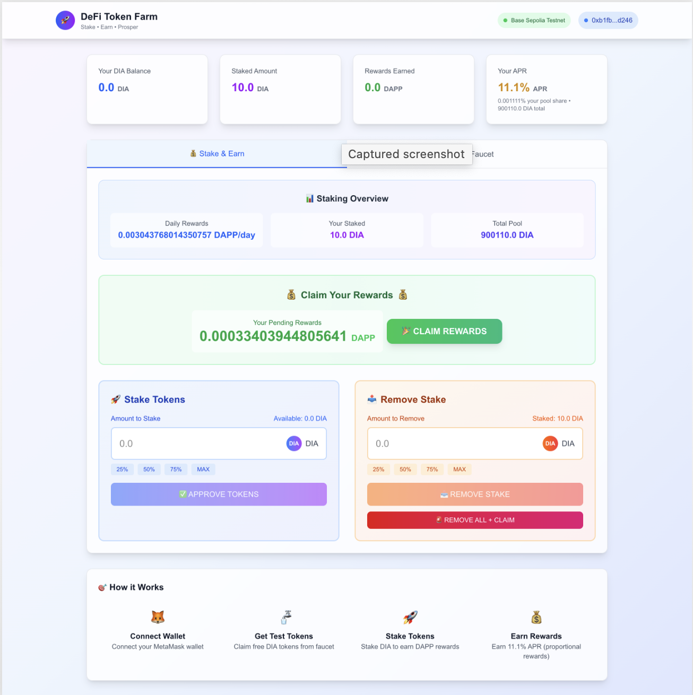

# 🚀 DApp Token Farm

A demo decentralized token staking platform built with Next.js and Hardhat. Users can stake DIA tokens to earn DAPP token rewards with real-time APR calculations and portfolio tracking.

## 🌐 Live Demo

**🚀 [Try it live: https://defi.roonnapai.dev/](https://defi.roonnapai.dev/)**



## ✨ Features

- **Token Staking**: Stake DIA tokens to earn DAPP token rewards
- **Faucet Integration**: Get test DIA tokens for testing
- **Real-time Portfolio**: Track balances, staking positions, and rewards
- **APR Calculations**: Dynamic APR based on pool size and rewards
- **Proportional Rewards**: Fair reward distribution based on stake percentage
- **MetaMask Integration**: Seamless wallet connection
- **Responsive UI**: Modern, mobile-friendly interface built with TailwindCSS

## 🛠️ Technology Stack

- **Frontend**: Next.js 15, React 19, TypeScript
- **Styling**: TailwindCSS 4
- **Blockchain**: Hardhat, Ethers.js 6
- **Wallet**: MetaMask integration
- **Testing**: Chai, Hardhat testing framework
- **Network**: Base Sepolia Testnet

## 📋 Prerequisites

- Node.js 18+ and npm/pnpm
- MetaMask browser extension
- Base Sepolia testnet configured in MetaMask

## 🚀 Quick Start

### 1. Clone and Install

```bash
git clone <your-repo-url>
cd dapp-demo
pnpm install
```

### 2. Environment Setup

Create a `.env.local` file in the root directory:

```env
# Add your environment variables here
NEXT_PUBLIC_NETWORK_ID=84532
NEXT_PUBLIC_NETWORK_NAME="Base Sepolia"
```

### 3. Run the Application

```bash
# Start the development server
pnpm dev

# Or run both blockchain and frontend
pnpm run dev:all
```

Open [http://localhost:3000](http://localhost:3000) to view the application.

## 🌐 Network Configuration

### Base Sepolia Testnet

- **Network Name**: Base Sepolia
- **RPC URL**: `https://sepolia.base.org`
- **Chain ID**: 84532
- **Currency Symbol**: ETH
- **Block Explorer**: `https://sepolia.basescan.org`

### Contract Addresses

- **DIA Token**: `0xFe55622104A05e4e0475d2B456A9f6845Ab74d12`
- **DAPP Token**: `0x008Fe3b45778e92804d081d9779d460B2a223DB1`
- **Token Farm**: `0x26cc25E3aE87BE2C49d1EF554dBbA7b8369c6591`

## 📖 How to Use

### 1. Connect Wallet
- Click "Connect Wallet" button
- Approve MetaMask connection
- Ensure you're on Base Sepolia testnet

### 2. Get Test Tokens
- Use the faucet to get DIA tokens for testing
- Faucet provides tokens for staking

### 3. Stake Tokens
- Enter amount to stake
- Approve token spending
- Confirm staking transaction
- Watch your rewards accumulate

### 4. Manage Staking
- View real-time APR and rewards
- Unstake partially or completely
- Claim earned DAPP token rewards

## 🏗️ Development

### Smart Contract Development

```bash
# Compile contracts
pnpm run compile

# Run tests
pnpm run test

# Start local blockchain
pnpm run node

# Deploy contracts locally
pnpm run deploy
```

### Frontend Development

```bash
# Run development server
pnpm dev

# Build for production
pnpm build

# Start production server
pnpm start

# Lint code
pnpm lint
```

## 📁 Project Structure

```
dapp-demo/
├── contracts/              # Smart contracts
│   └── modules/
├── src/
│   ├── app/               # Next.js app router
│   ├── components/        # React components
│   │   └── ui/           # UI components
│   ├── lib/              # Utility libraries
│   │   ├── blockchain.ts # Blockchain service
│   │   └── contracts.ts  # Contract definitions
│   └── types/            # TypeScript types
├── test/                 # Contract tests
├── hardhat.config.ts     # Hardhat configuration
├── next.config.ts        # Next.js configuration
└── tsconfig.json         # TypeScript configuration
```

## 🔧 Key Components

### BlockchainService (`src/lib/blockchain.ts`)
- Manages Web3 provider and signer
- Handles all contract interactions
- Provides wallet connection functionality
- Calculates staking metrics and APR

### Contract Interfaces (`src/lib/contracts.ts`)
- Type-safe contract interfaces
- Contract addresses and ABIs
- Helper functions for token formatting

## 🧪 Testing

The project includes comprehensive smart contract tests:

```bash
# Run all tests
pnpm test

# Run tests with gas reporting
pnpm test --gas

# Run tests on specific network
pnpm test --network hardhat
```

## 🚀 Deployment

### Frontend Deployment

Deploy to Vercel with one click:

[](https://vercel.com/new/clone?repository-url=https://github.com/your-username/dapp-demo)

### Smart Contract Deployment

Update contract addresses in `src/lib/contracts.ts` after deployment.

## 🔐 Security Features

- **Type Safety**: Full TypeScript implementation
- **Security Headers**: Configured in Next.js
- **Input Validation**: Comprehensive error handling
- **Web3 Security**: Proper transaction handling

## 🤝 Contributing

1. Fork the repository
2. Create a feature branch: `git checkout -b feature/amazing-feature`
3. Commit changes: `git commit -m 'Add amazing feature'`
4. Push to branch: `git push origin feature/amazing-feature`
5. Open a Pull Request

## 📄 License

This project is licensed under the MIT License - see the [LICENSE](LICENSE) file for details.

## 🆘 Support

- Check the [issues](https://github.com/your-username/dapp-demo/issues) page
- Review the [documentation](https://docs.example.com)
- Join our [Discord](https://discord.gg/example)

## 🙏 Acknowledgments

- [Next.js](https://nextjs.org/) - React framework
- [Hardhat](https://hardhat.org/) - Ethereum development environment
- [Ethers.js](https://ethers.org/) - Ethereum library
- [TailwindCSS](https://tailwindcss.com/) - CSS framework
- [Base](https://base.org/) - L2 blockchain platform

---

**Happy Staking! 🎉**
